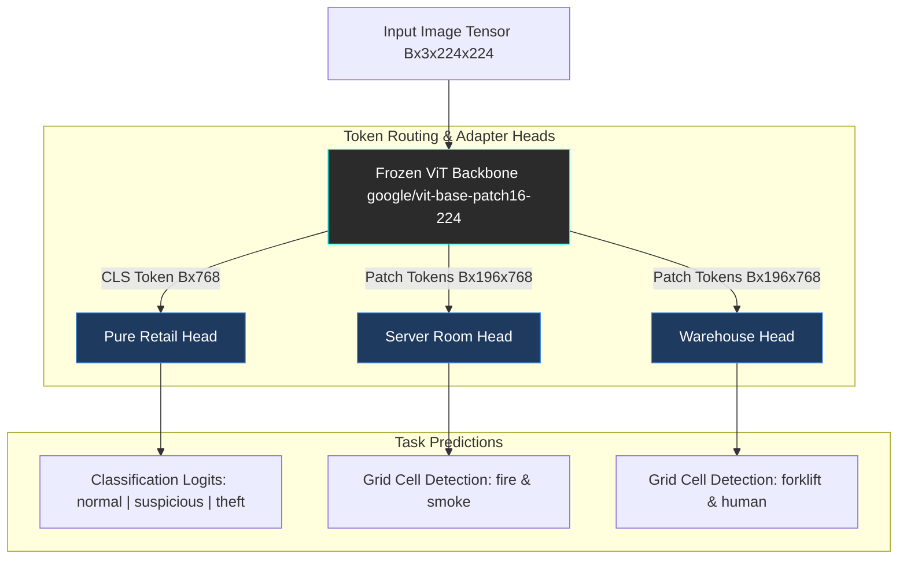

# 🚀 Multi-Tenant ViT Adapter Evaluation Pipeline

[](https://pytorch.org/)
[](https://huggingface.co/docs/transformers)
[](https://opensource.org/licenses/MIT)

A parameter-efficient, multi-tenant computer vision framework powered by a single frozen Vision Transformer (`google/vit-base-patch16-224`) backbone. **Multi-Tenant-ViT-Adapter-Evaluation-Pipeline** dynamically routes representations to decoupled, domain-isolated adapter heads for simultaneous spatial grid object detection (`server_room`, `warehouse`) and fine-grained threat/activity classification (`retail`).

---

## 📐 Architecture



---

## 🛠️ Key Features

- **Parameter-Efficient Multi-Tenancy:** Keeps the base ViT backbone 100% frozen, training lightweight task-specific adapter heads independently without catastrophic forgetting or cross-tenant feature interference.
- **14 × 14 Spatial Cell-Relative Decoding:** Custom object detection decoder projecting patch tokens into cell-relative bounding box coordinates ($y_{min}, x_{min}, y_{max}, x_{max}$) with Non-Maximum Suppression (NMS).
- **Class Imbalance Calibration:** Implements inverse class-frequency weighted loss functions for skewed retail data distributions, driving Macro Recall from 86% to 93%.
- **Automated Diagnostic Suite:** Automated end-to-end evaluation engine generating confidence threshold sweeps, IoU distributions, confusion matrices, and mAP performance metrics across all tenant domains.

---

## 📊 Benchmark Performance

### 1. Retail Classification (Calibrated)

| Class          | Precision | Recall   | F1-Score | Support  |
| :------------- | :-------- | :------- | :------- | :------- |
| **normal**     | 1.00      | 0.91     | 0.95     | 1395     |
| **suspicious** | 0.77      | 0.92     | 0.84     | 385      |
| **theft**      | 0.75      | 0.97     | 0.85     | 176      |
| **Macro Avg**  | **0.84**  | **0.93** | **0.88** | **1956** |

### 2. Detection Domains (conf=0.25, nms=0.45)

| Domain          | Target Classes          | Recall Proxy | Operational Performance Summary                                       |
| :-------------- | :---------------------- | :----------- | :-------------------------------------------------------------------- |
| **server_room** | `['fire', 'smoke']`     | 77.5%        | High sensitivity for spatial hazard localization with zero box bleed. |
| **warehouse**   | `['forklift', 'human']` | 62.5%        | Robust multi-object spatial localization under variable occlusion.    |

---

## 📁 Repository Structure

```text
Multi-Tenant-ViT-Adapter-Evaluation-Pipeline/
├── requirements.txt           # Verified runtime dependencies
├── scripts/
│   ├── audit.py               # Data integrity & tensor dimension validator
│   ├── dataset.py             # Multi-tenant PyTorch Dataset classes
│   ├── download_data.py       # Dataset loader and cache setup
│   ├── eval.py                # Evaluation utilities (IoU, mAP, NMS)
│   ├── train.py               # Uncalibrated baseline adapter trainer
│   ├── train_calibrated.py    # Class-weighted / calibrated adapter trainer
│   ├── phase1_diagnostics.py  # Threshold sweeps & score distribution logs
│   ├── phase2_diagnostics.py  # Grid-cell relative spatial decoding
│   ├── phase3_diagnostics.py  # Class-wise mAP & multi-tenant visualization engine
│   └── run_pipeline.py        # Master orchestrator script
└── outputs/                   # Generated evaluation artifacts
    ├── adapters/              # Trained PyTorch adapter weights (.pt)
    ├── diagnostics_phase1/    # Confidence sweeps & threshold distributions
    ├── diagnostics_phase2/    # Cell decoding diagnostics
    ├── diagnostics_phase3/    # Confusion matrices, IoU plots, and mAP summaries
    └── pipeline_execution_log.json
```

---

## 🚀 Quick Start

### 1. Installation

```bash
git clone https://github.com/tanishka4481/Multi-Tenant-ViT-Adapter-Evaluation-Pipeline.git
cd Multi-Tenant-ViT-Adapter-Evaluation-Pipeline
pip install -r requirements.txt
```

### 2. Train Adapters

```bash
# Train object detection adapter heads
python scripts/train.py --domain server_room
python scripts/train.py --domain warehouse

# Train calibrated retail classification adapter head
python scripts/train_calibrated.py --domain retail
```

### 3. Run Full Diagnostic Pipeline

Execute the master orchestrator to evaluate all domains, plot confusion matrices, calculate mAP, and generate evaluation logs:

```bash
python scripts/run_pipeline.py
```

---

## 📜 License

This project is licensed under the MIT License.
